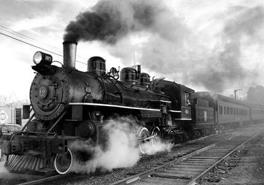

# image-steam

A simple, fast, and highly customizable realtime image manipulation web server built atop Node.js. Serving (many) millions of images daily by way of simple (single DC, simple storage) and advanced (multi-DC geo-distributed, replicated storage, multi-tier caching) configurations. Responsible in part for this [white paper](https://www.godaddy.com/garage/site-speed-small-business-website-white-paper/).

**Notice:** [v0.41 Introduces Minor Breaking Changes](./CHANGELOG.md)

[](https://nodei.co/npm/image-steam/)

# What is Image Steam?



```
http://localhost:13337/my-app/some-path/my-image.jpg/:/rs=w:640/cr=l:5%25,t:10%25,w:90%25,h:80%25/fx-gs
```

Consider the above isteam example, by allowing clients to directly request any variation of an image using few or many image instructions, and in near realtime. This opens the doors to improved user and developer experiences. The above example takes the requested image `some-path/my-image.jpg`, resizes to a fixed width (preserving aspect, by default), crops around the edges like a picture frame, applies greyscale effects, and will auto-select the most optimal image format supported by the requesting device -- all without developer support, and in (near) realtime.

| Layer | Info |
| --- | --- |
| node.js http(s) | RESTful interface |
| routing | URI pathing that make up the desired image operations. Device aware - Supports implied optimizations based on the given request (notably `webp` support) |
| throttling | Quality of service management |
| security | Allows protecting resources behind the tranformations via signed requests |
| optimized original | Optimization of uploaded originals |
| storage | Storage engine for reads (original or cache) and writes (cache). Extensible storage clients for storage and caching |
| processor | Image operations (resize, crop, etc) go here, powered by [Sharp](http://sharp.dimens.io/en/stable/) and [libvips](https://github.com/jcupitt/libvips/) |


# Why Image Steam?

There are a number of options out there, but isteam differentiates itself by:

| Feature | Info |
| --- | --- |
| Highly configurable | Everything all the way down to how image operations are mapped can be overridden. Most solutions are very prescriptive on how it must work. *isteam* is intended to adhere to *your* architecture, *your* storage, *your* caching, *your* replication patterns |
| Optimized | Optimizes originally uploaded asset to account for large uploads, enabling a higher quality service by making the pipeline for image operations substantially faster. A critical feature in supporting large media of todays modern devices |
| QoS | Quality of service features such as throttling and memory thresholds, to best take advantage of your hardware under ideal and non ideal scenarios |
| Device Aware | Device centric responses, where more than a URI may influence response. Compression and Accepts header (i.e. WebP) being examples |
| CDN Support | Supported, but not required |
| Library Agnostic | Provides an abstraction atop image processing libraries, enabling per-operation level of control to enable using the right tool for the given operation. Bugs, features, performance are a few of the factors that may influence this |
| Friendly CLI | No custom app required to create your image API |
| Platform Agnostic | Good *Nix & Windows support |


# Installation

The speed and power of this module would not be possible without the incredible
work of libvips (low level image processor), Sharp (depends on libvips), and xxHash
for lightning-fast hashing.

Install Sharp via http://sharp.dimens.io/en/stable/install/ - This should also take care of the libvips dependency.


# Usage

## Standalone Server

While Routing, Throttling, and Storage are all independently usable and configurable,
a basic usage example that pulls everything together can be as simple as:

```
npm install image-steam -g
isteam --isConfig './myconfig.json' --isConfig './mydefaults.json'
```

Defaults are optional. Config can also be a CommonJS file:

```
isteam --isConfig './myconfig.js'
```

## Connect Middleware

Or if you prefer to incorporate into your own app:

```
var http = require('http');
var imgSteam = require('image-steam');

http.createServer(new imgSteam.http.Connect({ /* options */ }).getHandler())
  .listen(13337, '127.0.0.1')
;
```

Which is equivalent of cloning this repo and invoking `npm start`.

## Cloning

If you plan to hack on isteam:

```
git clone git@github.com:asilvas/node-image-steam.git
cd ./node-image-steam
npm install
npm start
```

***^ May require sudo or admin rights.***


# Performance

While this module provides granular control over HTTP throttling to provide
the highest quality of service possible, performance is entirely from Sharp
and libvips: http://sharp.dimens.io/en/stable/performance/#performance


# Options

```
isteam --isConfig './myconfig.json'
```

## HTTP Options

```
{
  "http": [
    { "port": 80 },
    { "port": 443, "ssl": {} }
  ]
}
```

| Option | Type | Default | Info |
| --- | --- | --- | --- |
| port | `number` | `13337` | Port to bind to |
| host | `string` | `"localhost"` | Host to bind to |
| backlog | `number` | `511` | [TCP backlog](https://nodejs.org/api/net.html#net_server_listen_port_host_backlog_callback) |
| ssl | [TLS Options](https://nodejs.org/api/tls.html#tls_tls_createserver_options_secureconnectionlistener) | `undefined` | If object provided, will bind with [TLS Options](https://nodejs.org/api/tls.html#tls_tls_createserver_options_secureconnectionlistener) |
| ssl.pfx | `Buffer` or `string` | `undefined` | If string, will auto-load from file system |
| ssl.key | `Buffer` or `string` | `undefined` | If string, will auto-load from file system |
| ssl.cert | `Buffer` or `string` | `undefined` | If string, will auto-load from file system |


## Storage Options

```
{
  "storage": {
    "defaults": {
      "driverPath": "image-steam-s3",
      "endpoint": "s3.amazonaws.com",
      "accessKey": "abc",
      "secretKey": "123"
    }
  }
}
```

| Option | Type | Default | Info |
| --- | --- | --- | --- |
| defaults | `StorageOptions` | *optional* | If provided, these options will be the defaults applied to all StorageOptions. **Note:** At least one of `defaults`, `app`, `domain`, or `header` are required |
| app | `Object<StorageOptions>` | *optional* | If provided, allows for driver-specific options to be applied on a per-request basis, based on the route. If no match is found, the original options provided at initialization will be used. Example: `{ "some-app": StorageOptions } }`. |
| domain | `Object<StorageOptions>` | *optional* | If provided, allows for driver-specific options to be applied on a per-request basis, based on the host header. If no match is found, the original options provided at initialization will be used. Example: `{ "somedomain.com": StorageOptions }`. **Note:** You must still provide root level `storage` options to act as defaults |
| header | `Object<StorageOptions>` | *optional* | If provided, allows for driver-specific options to be applied on a per-request basis, based on `x-isteam-app` header. If no match is found, the original options provided at initialization will be used. Example: `{ "some-other-app": StorageOptions }`. **Note:** You must still provide root level `storage` options to act as defaults |
| cache | `StorageOptions` | *optional* | If provided, allows for driver-specific options to be applied for all cache objects. This effectively puts the api into a read-only mode for original assets, with all writes going exclusively to a single cache store |
| cacheOptimized | `StorageOptions` | *optional* | If provided, will attempt to access *only* optimized original assets from this storage. This permits splitting of cache for sake of replication or eviction policies. If supplied, this also means delete requests will be supplied to both caches |
| cacheArtifacts | `boolean` | `true` | If `false`, processed image artifacts will not be cached. Useful if limited cache capacity |
| cacheTTS | `number` | *optional* | If provided, when artifacts or optimized originals (unless `cacheOptimizedTTS` is also provided) are fetched from cache, if the age of the object exceeds this time-to-stale value (in seconds), it's age will be reset (implementation varies by storage client, but defaults to copying onto itself). This is a powerful pattern in cases where the cache storage leverages time-to-live, but you do not want active objects to be deleted at the expense of the user experience (and cost). When an object is "refreshed", it will only impact the storage of the stale object, ignoring `replicas` option. A refresh is out-of-band of the request |
| cacheOptimizedTTS | `number` | *optional* | If provided, when *optimized original* are fetched from cache, if the age of the object exceeds this time-to-stale value (in seconds), it's age will be reset (implementation varies by storage client, but defaults to copying onto itself). This is a powerful pattern in cases where the cache storage leverages time-to-live, but you do not want active objects to be deleted at the expense of the user experience (and cost). When an object is "refreshed", it will only impact the storage of the stale object, ignoring `replicas` option. A refresh is out-of-band of the request |
| replicas | `Object<StorageReplica>` | *optional* | If provided, all cache writes will also be written (out-of-band) to the desired storage replicas. Example: `{ remoteCache: { cache: { /* options */ }, cacheOptimized: { /* options */ } } }`. Where `remoteCache` is the name of a storage I want to forward my writes to. This feature provides a high degree of flexibility when determining your distribution of data across the globe, without the fixed replication that may be permitted by the storage provided (ala S3 replication). |
| replicas[].cache | `StorageOptions` | *optional* | Same behavior as `storage.cache` |
| replicas[].cacheOptimized | `StorageOptions` | *optional* | Same behavior as `storage.cacheOptimized` |
| replicas[].replicateArtifacts | `boolean` | `true` | In some cases it may be too costly to replicate all image artifacts, especially when the location you're replicating to may receive small amounts of traffic for the same images. By disabling this flag, only optimized original images will be written to replicas |

### StorageOptions

| Option | Type | Default | Info |
| --- | --- | --- | --- |
| driver | `string` | `driver` or `driverPath` ***required*** | Bundled storage driver to use |
| driverPath | `string` | `driver` or `driverPath` ***required*** | Load a custom driver from the desired path, ignoring the `driver` option |
| *(driver options)* | | | All other options will be supplied to the storage driver indicated by `driver` or `driverPath` |

***Advanced*** storage example:

```
{
  "storage": {
    "defaults": {
      "driverPath": "image-steam-s3",
      "endpoint": "s3.amazonaws.com
    },
    "app": {
      "app1": {
        "accessKey": "key1",
        "secretKey": "secret1"
      }
    },
    "cache": {
      "endpoint": "<dc1 endpoint>",
      "accessKey": "key2",
      "secretKey": "secret2"
    },
    "cacheTTS": 86400, /* 24 hrs */
    "cacheOptimizedTTS": 43200, /* 12 hrs */
    "replicas": {
      "dc2Cache": {
        "cache": {
          "endpoint": "<dc2 endpoint>",
          "accessKey": "key3",
          "secretKey": "secret3"
        }
      }
    }
  }
}
```


### Bundled Storage Clients

#### Storage Client - File System

| Option | Type | Default | Info |
| --- | --- | --- | --- |
| driver=fs | | | File System |
| path | `string` | ***required*** | Root path on file system |

#### Storage Client - HTTP

| Option | Type | Default | Info |
| --- | --- | --- | --- |
| driver=http |  | | ***Read-Only*** driver for web resource |
| endpoint | `string` | ***required*** | Endpoint of http(s) service |
| bucket | `string` | *optional* | If provided, will not attempt to take bucket from path |

#### Custom Client

Custom storage types can easily be added via exporting `fetch` and `store`.
See `lib/storage/fs` (read/write/delete) or  `lib/storage/http` (read only) for reference.


### External Storage Clients

* https://github.com/asilvas/image-steam-s3 - S3 client built on [knox](https://github.com/Automattic/knox)
* https://github.com/asilvas/image-steam-redis - Redis client built on [ioredis](https://github.com/luin/ioredis)
* https://github.com/asilvas/image-steam-blobby - [Blobby](https://github.com/asilvas/blobby) client over HTTP(S)


## Throttle Options

Throttling allows for fine grain control over quality of service, as well as optimizing to your hardware.

```
{
  "throttle": {
    "ccProcessors": 4,
    "ccPrefetchers": 20,
    "ccRequests": 100
  }
}
```

| Option | Type | Default | Info |
| --- | --- | --- | --- |
| ccProcessors | `number` | `4` | Number of concurrent image processing operations. Anything to exceed this value will wait (via semaphore) for next availability |
| ccPrefetchers | `number` | `20` | Number of concurrent storage request operations. This helps prevent saturation of your storage and/or networking interfaces to provide the optimal experience |
| ccRequests | `number` | `100` | Number of concurrent http requests. Anything to exceed this value will result in a 503 (too busy), to avoid an indefinite pileup |


## Router Options

Most router defaults should suffice, but you have full control over routing. See [Routing](#routing) for more details.

```
{
  "router": {
    "originalSteps": {
      "resize": {
        "width": "2560", "height": "1440", "max": "true", "canGrow": "false"
      }
    }
  }
}
```

| Option | Type | Default | Info |
| --- | --- | --- | --- |
| pathDelimiter | `string` | `"/:/"` | Unique (uri-friendly) string to break apart image path, and image steps |
| cmdKeyDelimiter | `string` | `"/"` | Separator between commands (aka image steps) |
| cmdValDelimiter | `string` | `"="` | Separator between a command and its parameters |
| paramKeyDelimiter | `string` | `","` | Separator between command parameters |
| paramValDelimiter | `string` | `":"` | Separator between a parameter key and its value |
| signatureDelimiter | `string` | `"/-/"` | Separator between steps and the signed url |
| originalSteps | `object` | [Full Defaults](https://github.com/asilvas/node-image-steam/blob/master/lib/router/router-defaults.js) | Steps performed on the original asset to optimize subsequent image processing operations. This can greatly improve the user experience for very large, uncompressed, or poorly compressed images |
| steps | `object` |  [Full Defaults](https://github.com/asilvas/node-image-steam/blob/master/lib/router/router-defaults.js) | Mapping of URI image step commands and their parameters. This allows you to be as verbose or laconic as desired |


# Routing

Routing is left-to-right for legibility.

Routing format:

```
{path}{pathDelimiter}{cmd1}{cmdValDelimiter}{cmd1Param1Key}{paramValDelimiter}{cmd1Param1Value}{paramKeyDelimiter}{cmdKeyDelimiter}{signatureDelimiter}{signature}?{queryString}
```

Example URI using [Default Options](#router-options):

```
some/image/path/:/cmd1=param1:val,param2:val,param3noVal/cmd2NoParams?cache=false
```

Or a more real-world example:  

```
/my-s3-bucket/big-image.jpg/:/rs=w:640/cr=w:90%25,h:90%25
```

See [Things to Try](#things-to-try) for many more examples.

# Supported Operations

## Resize (rs)

Resize an image, preserving aspect or not.

| Argument | Type | Default | Desc |
| --- | --- | --- | --- |
| `w` | Number/Unit | `w` OR `h` **required** | Width of new size. Supports Dimension Modifiers |
| `h` | Number/Unit | `w` OR `h` **required** | Height of new size. Supports Dimension Modifiers |
| `mx` | n/a | **default** | Retain aspect and use dimensions as the maximum permitted during resize |
| `m` | n/a | *optional* | Retain aspect and use dimensions as the minimum permitted during resize. Set to any value to enable |
| `i` | Boolean | `false` | If `true` will break aspect and resize to exact dimensions |
| `cg` | Boolean | `false` | If `true`, will allow image to exceed the dimensions of the original |
| `int` | String | `bicubic` | Process to use for resizing, from fastest to slowest |
| | | `nearest` | Use nearest neighbour interpolation, suitable for image enlargement only |
| | | `bilinear` | Use bilinear interpolation, the default and fastest image reduction interpolation |
| | | `bicubic` | Use bicubic interpolation, which typically reduces performance by 5% |
| | | `vsqbs` |  Use vertexSplitQuadraticBasisSpline interpolation, which prevents "staircasing" and typically reduces performance by 5% |
| | | `lbb` | Use LBB interpolation, which prevents some "acutance" and typically reduces performance by a factor of 2 |
| | | `nohalo` | Use Nohalo interpolation, which prevents acutance and typically reduces performance by a factor of 3 |

### Examples

1. `rs=w:640` - Resize up to 640px wide, preserving aspect.
2. `rs=h:480` - Resize up to 480px tall, preserving aspect.
3. `rs=w:1024,h:768,m,cg:true` - Resize to a minimum of 1024 by 768, preserving aspect, and allow it to exceed size of original.


## Crop (cr)

Crop an image to an exact size.

| Argument | Type | Default | Desc |
| --- | --- | --- | --- |
| `t` | Number/Unit | `0` | Offset from top. Supports Dimension Modifiers |
| `l` | Number/Unit | `0` | Offset from left. Supports Dimension Modifiers |
| `w` | Number/Unit | `width-left` | Width of new size. Supports Dimension Modifiers |
| `h` | Number/Unit | `height-top` | Height of new size. Supports Dimension Modifiers |
| `a` | String | `cc` | Where to anchor from, using center-center by default. Top and Left are applied from the anchor. Possible horizontal axis values include left (l), center (c), and right (r). Possible vertical axis values include top (t), center (c), and bottom (b) |
| `ay` | Number/Unit | `50%` | Can be used to absolutely position the anchor offset vertically using either percentage or pixel values. Also supports offsets relative to the Anchor value |
| `ax` | Number/Unit | `50%` | Can be used to absolutely position the anchor offset horizontally using either percentage or pixel values. Also supports offsets relative to the Anchor value |

### Examples

1. `cr=t:10%25,l:10%25,w:80%25,h:80%25` - Crop 10% around the edges
2. `cr=w:64,h:64,a:cc` - Crop 64x64 anchored from center.
3. `cr=l:10,w:64,h:64` - Crops 64x64 from the left at 10px (ignoring the horizontal
   axis value of `c`), and vertically anchors from center since top is not provided.
4. `cr=w:64,h:64,ax:30%25,ay:70%25` - Crops 64x64 anchored (centered) 30% from the left edge of the
   image and 70% from the top edge of the image.
5. `cr=w:64,h:64,ax:100,ay:200` - Crops 64x64 anchored (centered) 100 pixels from the left edge
   of the image and 200 pixels from the top edge of the image.
6. `cr=w:64,h:64,a:br,ax:-20%,ay:-30%` - Crops 64x64 anchored 20% from the right edge and 30% from
   the bottom of the image.


## Gamma (gm)

Apply a gamma correction by reducing the encoding (darken) pre-resize
at a factor of 1/gamma then increasing the encoding (brighten) post-resize
at a factor of gamma.

This can improve the perceived brightness of a resized image
in non-linear colour spaces.

| Argument | Type | Default | Desc |
| --- | --- | --- | --- |
| `g` | Number | `2.2` | A float between 1 and 3. The default value is 2.2, a suitable approximation for sRGB images |

JPEG input images will not take advantage of the shrink-on-load
performance optimisation when applying a gamma correction.


## Background (bg)

| Argument | Type | Default | Desc |
| --- | --- | --- | --- |
| `r` | Number | **required** | Red component of the RGB(A) spectrum. An integer between 0 and 255. Do not use in conjunction with Hex color |
| `g` | Number | **required** | Green component of the RGB(A) spectrum. An integer between 0 and 255. Do not use in conjunction with Hex color |
| `b` | Number | **required** | Blue component of the RGB(A) spectrum. An integer between 0 and 255. Do not use in conjunction with Hex color |
| `a` | Number | *optional* | Optional Alpha component of the RGB(A) spectrum. A float value between 0 (transparent) and 1 (opaque). Can be used in conjunction with Hex color |
| `#` | Number | *optional* | Full hex color (i.e. `ffffff`). Partial (i.e. `fff`) not supported. Do not use in conjunction with RGB color. Alpha is OK |


## Flatten (ft)

Merge alpha transparency channel, if any, with background.


## Rotate (rt)

| Argument | Type | Default | Desc |
| --- | --- | --- | --- |
| `d` | Number | `0` | Degrees to rotate the image, in increments of 90. Future implementations may support non-optimized degrees of rotation. Specify `0` to auto-rotate based on orientation |

### Examples

1. `rt=d:90` - Rotate 90 degrees.


## Flip (fl)

Not to be confused with rotation, flipping is the process of flipping
an image on its horizontal and/or vertical axis.

| Argument | Type | Default | Desc |
| --- | --- | --- | --- |
| `x` | n/a | *optional* | Flip on the horizontal axis. No value required |
| `y` | n/a | *optional* | Flip on the vertical axis. No value required |

### Examples

1. `fl=x` - Flip horizontally.
2. `fl=x,y` - Flip on x and y axis.


## Quality (qt)

The output quality to use for lossy JPEG, WebP and TIFF output formats.

| Argument | Type | Default | Desc |
| --- | --- | --- | --- |
| `q` | Number | `80` | Value between 1 (worst, smallest) and 100 (best, largest) |


## Compression (cp)

An advanced setting for the zlib compression level of the lossless
PNG output format. The default level is 6.

| Argument | Type | Default | Desc |
| --- | --- | --- | --- |
| `c` | Number | `6` | Number between 0 and 9 |


## Progressive (pg)

Use progressive (interlace) scan for JPEG and PNG output. This
typically reduces compression performance by 30% but results in
an image that can be rendered sooner when decompressed.

Can be useful for images that always need to be seen ASAP, but should
not be used otherwise to save bandwidth.

### Examples

1. `rs=w:3840/pg` - Create a big 4K-ish image and use progressive rendering
   to demonstrate value in some use cases.


## Format (fm)

Supported, but not enabled by default in [Router Options](#router-options).
Recommended to keep disabled in router, as internally format will be
best determined by the individual request.

Override the auto-detected optimal format to output. Do not use this unless
you have good reason.

| Argument | Type | Default | Desc |
| --- | --- | --- | --- |
| `f` | String | **required** | Format to output: `"jpeg"`, `"png"`, or `"webp"` |


## Metadata (md)

Carry metadata from the original image into the outputted image. Enabled by default.

| Argument | Type | Default | Desc |
| --- | --- | --- | --- |
| `e` | Boolean | `true` | Set to `false` to not preserve metadata from original |


## Sharpen (fx-sp)

| Argument | Type | Default | Desc |
| --- | --- | --- | --- |
| `r` | Number | *optional* | Sharpening mask to apply in pixels, but comes at a performance cost |
| `f` | Number | `1.0` | Sharpening to apply to flat areas |
| `j` | Number | `2.0` | Sharpening to apply to jagged areas |

### Examples

1. `fx-sp=r:3,f:5,j:5` -


## Blur (fx-bl)

Fast mild blur by default, but can override the default sigma for more
control (at cost of performance).

| Argument | Type | Default | Desc |
| --- | --- | --- | --- |
| `s` | Number | `2.0` | The approximate blur radius in pixels, from 0.3 to 1000 |

### Examples

1. `fx-bl=s:5` - Blur using a stima radius of 5 pixels.


## Greyscale (fx-gs)

Convert to 8-bit greyscale.


## Normalize (fx-nm)

Enhance output image contrast by stretching its luminance to cover the full
dynamic range. This typically reduces performance by 30%.


## Info ($info)

Returns all known information about the image, including [Saliency](#saliency) if available.

```
{
  "info": {
    "path": "family.jpg",
    "lastModified": "2017-10-30T23:27:06.000Z",
    "format": "webp",
    "width": 1706,
    "height": 2560,
    "space": "srgb",
    "channels": 3,
    "depth": "uchar",
    "density": 600,
    "hasProfile": true,
    "hasAlpha": false,
    "orientation": 1,
    "hash": 3979799324,
    "byteSize": 1337334,
    "saliency": {
      "v": 1,
      "c": {
        "x": 0.488,
        "y": 0.4576
      },
      "r25th": {
        "l": 0.45,
        "t": 0.4,
        "w": 0.25,
        "h": 0.2
      },
      "r40th": {
        "l": 0.4,
        "t": 0.35,
        "w": 0.3,
        "h": 0.25
      },
      "r50th": {
        "l": 0.35,
        "t": 0.35,
        "w": 0.35,
        "h": 0.3
      },
      "r75th": {
        "l": 0.3,
        "t": 0.1,
        "w": 0.45,
        "h": 0.7
      },
      "r90th": {
        "l": 0.2,
        "t": 0.05,
        "w": 0.65,
        "h": 0.8
      }
    }
  }
}
```


## Colors ($colors)

A new (ALPHA) command to retrieve a list of palette colors from image in JSON format.

| Argument | Type | Default | Desc |
| --- | --- | --- | --- |
| `w` | Number | `100` | Width of image. `w` OR `h` must be set. |
| `h` | Number | undefined | Height of image. `w` OR `h` must be set. |
| `mc` | Number | `10` | Max colors to return |
| `cc` | Number | `4` | Cubic cells (3 or 4) |
| `mn` | Boolean | `true` | Use mean color (`true`) or median color (`false`) |
| `o` | String | `distance` | Order of results, `distance` between colors, or based on cell `density` |

See [Image-Pal](https://github.com/asilvas/image-pal#options) for more details.

### Examples

1. `$colors` - Get colors using default options.
2. `$colors=mn:false` - Get colors using median color logic (ideal for logos).


## Saliency ($saliency)

***Experimental***

Return data that describes the salient regions of an image in JSON format.

See [Saliency](#saliency) for more details.


## Saliency Map ($saliencyMap)

***Experimental*** For TESTING only. Very CPU intensive, and should not be enabled in production.

Return saliency image to better understand how the configured model is performing.

See [Saliency](#saliency) for more details.

| Argument | Type | Default | Desc |
| --- | --- | --- | --- |
| `w` | Number | `200` | Width of saliency image |
| `h` | Number | `200` | Height of saliency image |
| `m` | String | `"deep"` | Saliency model to use |
| `af` | n/a | n/a | Shows bounding regions of auto-focus |


# Dimension Modifiers

Dimension modifiers can be applied to any values where size and
location are represented.

## Pixels

Any numeric value around measurement without explicit unit type
specified is implicitly of type px.

### Examples
1. `rs=w:200,h:300` - 200x300 pixels
2. `rs=w:200px,h:300px` - Identical to #1
3. `cr=t:15,l:10,w:-10,h:-15` - Using pixel offsets


## Percentage

A percentage applied to original value by supplying the percentage (%) modifier. Notice that
`%` must be encoded as `%25`.

### Examples
1. `rs=w:50%25,h:50%25` - 50% of source width and height
2. `cr=t:15%25,l:10%25,w:80%25,h:70%25` - 15% from top and bottom, 10% from left and right


## Offset

To be used in conjunction with locations or dimensions,
a plus (+) or minus (-) may be used to imply offset from original.

### Examples

1. `rs=w:+50px,h:-50px` - 50px wider than original, 50px shorter than original
2. `rs=w:+10%25,h:-10%25` - 10% wider than original, 10% shorter than original


## Processor Options

Relying on sharp/libvips, and potentially other image processors in the future.

```
{
  "processor": {
    "sharp": {
      "cache": {
        "memory": 50, "files": 20, "items": 200
      },
      "concurrency": 0,
      "simd": false
    }
  }
}
```

| Option | Type | Default | Info |
| --- | --- | --- | --- |
| sharp | [SharpOptions](http://sharp.pixelplumbing.com/en/stable/api-utility/) | | |
| sharp.cache | [CacheOptions](http://sharp.pixelplumbing.com/en/stable/api-utility/#cache) | | |
| sharp.cache.memory | `number` | `50` | Maximum memory in MB to use for this cache |
| sharp.cache.files | `number` | `20` | Maximum number of files to hold open |
| sharp.cache.items | `number` | `200` | Maximum number of operations to cache |
| sharp.concurrency | `number` | `0` | Number of threads to process each image in parallel. A value of 0 will use all available cores |
| sharp.simd | `boolean` | `false` | Improves the performance of resize, blur and sharpen operations by taking advantage of the SIMD vector unit of the CPU, e.g. Intel SSE and ARM NEON |


# Error Handling

All major classes inherit from EventEmitter. By default `http.start` will
log errors to `stderr`, but can be disabled in options by setting
`log.errors` to `false` if you want more fine grained control.

## Connect Errors

The next level down is Connect, and all child classes (shown below) will
bubble up through this class:

```
var http = require('image-steam').http;
var connect = new http.Connect();
connect.on('error', function(err) { /* do something */ });
```


## Throttle Errors

A lower level class with no children:

```
var http = require('image-steam').http;
var throttle = new http.Throttle();
throttle.on('error', function(err) { /* do something */ });
```


## Processor Errors

A lower level class with no children:

```
var Processor = require('image-steam').Processor;
var processor = new Processor();
processor.on('error', function(err) { /* do something */ });
```


## Storage Errors

A lower level class with no children:

```
var Storage = require('image-steam').Storage;
var storage = new Storage();
storage.on('error', function(err) { /* do something */ });
```


## Security Options

Security allows protecting the image resources behind each tranformation. This will sign resource+transformation with the specified secret.

A signed url would look like this:

```
/my-s3-bucket/big-image.jpg/:/rs=w:640/cr=w:90%25,h:90%25/-/k5G5dlr9
```

```
{
  "security": {
    "enabled": true,
    "secret": keyboard_cat,
    "algorithm": 'sha1'
  }
}
```

| Option | Type | Default | Info |
| --- | --- | --- | --- |
| enabled | `boolean` | `false` | If this feature is enabled, all requests urls will must be signed |
| secret | `string` | ***required*** | The signing secret |
| algorigthm | `string` | `sha1` | The hashing algorithm. Complete list: `openssl list-cipher-algorithms` |

The following snippet shows how to sign a url (using the library defaults).

```
var crypto = require('crypto');
var shasum = crypto.createHash(YOUR_HASHING_ALGORITHM); // sha256 recommended
shasum.update('/' + IMAGE_PATH + '/:/' + IMAGE_STEPS + YOUR_SECRET);
var signature = shasum.digest('base64').replace(/\//g, '_').replace(/\+/g, '-').substring(0, 8);
var url = '/' + YOUR_IMAGE_PATH + '/:/' + YOUR_IMAGE_STEPS + '/-/' + signature;
```


# Saliency

A new and ***experimental*** feature that allows intellegent auto-focus during crop operations
to avoid cropping critical regions of an image. Disabled by default, and requires installation
of optional packages `opencv4nodejs` and `salient-maps`. See [Saliency Options](#saliency-options)
for how to enable and configure this feature.

## Examples

1. `cr=w:50%,h:50%,a:auto` - Crop at 50% and set anchor to auto-focus the most salient region.
2. `$saliency` - Return data to describe the saliency regions.
3. `$saliencyMap` - Get a visual representation of what the computer sees as salient.

## Saliency Options

```
{
  "saliency": {
    enabled: true,
    version: 1,
    autoCrop: true,
    alwaysOn: true,
    model: 'deep',
    map: false,
    options: {
      width: 200,
      height: 200
    }
  }
}
```

| Option | Type | Default | Info |
| --- | --- | --- | --- |
| enabled | `boolean` | `false` | Enables saliency which depends on installation of optional packages `opencv4nodejs` and `salient-maps` |
| version | `number` | `1` | Used for evicting old saliency caches when making upgrades. Should only be used if a breaking change is made |
| autoCrop | `boolean` | `true` | If enabled, `crop` will set `anchor` to `auto` by default, auto-cropping based on salient region. May want to disable if already using previous defaults |
| alwaysOn | `boolean` | `true` | If enabled, all optimized images generated will process saliency data to be cached. Should be enabled unless rolling out to a small percentage of users |
| model | `string` | `"deep"` | See [Salient Models](https://github.com/asilvas/salient-maps#models) for other options |
| map | `boolean` | `false` | Enables the `$salientMap` command. Should not be enabled in production environments |
| options.width | `number` | `200` | Width of saliency map generated. Different models produce higher quality saliency with more pixels, but at the cost of performance |
| options.height | `number` | `200` | Height of saliency map generated. Different models produce higher quality saliency with more pixels, but at the cost of performance |


# Things to try:

* `rs=w:640` - Resize to 640 width, retain aspect
* `rs=w:640/cr=l:5%,t:10%,w:90%,h:80%` - Same as above, and
  crop 5% of the sides and 10% of the top and bottom
* `rs=w:640/cr=l:5%,t:10%,w:90%,h:80%/fx-gs` - Same as above, and
  apply greyscale effect.
* `rs=w:640/cr=l:5%,t:10%,w:90%,h:80%/fx-gs/qt=q:20` - Same as above, and
  use a low quality of 20.
* `rs=w:64,h:64,m/cr=w:64,h:64/fx-gs` - Resize image to a *minimum* of 64x64
  w/o breaking aspect so that we can then crop the image and apply
  greyscale.
* `fx-bl=s:5` - Apply a blur


## License

[MIT](https://github.com/asilvas/node-image-steam/blob/master/LICENSE.txt)
