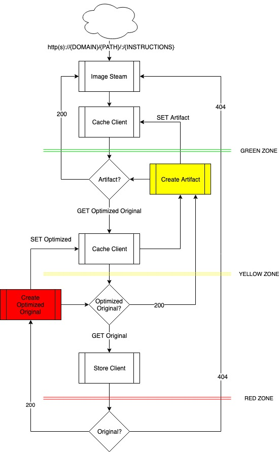

# image-steam

[](https://github.com/asilvas/node-image-steam/actions)
[](https://nodei.co/npm/image-steam/)

A simple, fast, and highly customizable realtime image manipulation web server built atop Node.js. Serving (many) millions of images daily by way of simple (single DC, simple storage) and advanced (multi-DC geo-distributed, replicated storage, multi-tier caching) configurations. Responsible in part for this [white paper](https://www.godaddy.com/garage/site-speed-small-business-website-white-paper/).

> **🎉 v1.0 launched!** Full TypeScript/ESM rewrite, first-class **Windows** and **Bun** support, and zero native build dependencies — with cache keys fully compatible with prior versions. See the [CHANGELOG](./CHANGELOG.md).

## What is Image Steam?

You give it your original images (on disk, S3, any HTTP endpoint, or your own storage), and your clients request any variation of them through the URL — resize, crop, rotate, effects, format conversion, and more. Variations are processed on the fly, cached, and served in the most optimal format the requesting device supports (WebP/AVIF aware). No image build pipelines, no pre-generating thumbnails.

```
http://localhost:13337/my-app/some-path/my-image.jpg/:/rs=w:640/cr=l:5%25,t:10%25,w:90%25,h:80%25/fx-gs
```

The above takes `some-path/my-image.jpg`, resizes it to 640px wide (preserving aspect), crops 5%/10% around the edges like a picture frame, applies greyscale, and auto-selects the best output format for the device — in near realtime.



| Layer | Info |
| --- | --- |
| node.js http(s) | RESTful interface |
| routing | URI pathing that makes up the desired image operations. Device aware - supports implied optimizations based on the given request (notably `webp`/`avif` support) |
| throttling | Quality of service management |
| security | Allows protecting resources behind the transformations via signed requests |
| optimized original | Optimization of uploaded originals |
| storage | Storage engine for reads (original or cache) and writes (cache). Extensible storage clients for storage and caching |
| processor | Image operations (resize, crop, etc) go here, powered by [sharp](https://sharp.pixelplumbing.com/) and [libvips](https://github.com/libvips/libvips) |

### Why Image Steam?

There are a number of options out there, but isteam differentiates itself by:

| Feature | Info |
| --- | --- |
| Highly configurable | Everything all the way down to how image operations are mapped can be overridden. Most solutions are very prescriptive on how it must work. *isteam* is intended to adhere to *your* architecture, *your* storage, *your* caching, *your* replication patterns |
| Optimized | Optimizes originally uploaded asset to account for large uploads, enabling a higher quality service by making the pipeline for image operations substantially faster. A critical feature in supporting large media of today's modern devices |
| QoS | Quality of service features such as throttling and memory thresholds, to best take advantage of your hardware under ideal and non ideal scenarios |
| Device Aware | Device centric responses, where more than a URI may influence response. Compression and Accepts header (i.e. WebP/AVIF) being examples |
| CDN Support | Supported, but not required |
| Runtime Agnostic | Runs on **Node.js (>=24)** and **Bun**, on Windows, macOS, and Linux — [equivalent performance](./BENCH.md) on both runtimes |
| Friendly CLI | No custom app required to create your image API |


# Quick Start

Requires Node.js >=24 (or Bun). [sharp](https://sharp.pixelplumbing.com/install) installs prebuilt binaries automatically on all major platforms.

**1. Install:**

```
npm install -g image-steam
```

**2. Create a minimal config** (`myconfig.json`) pointing at a folder of images:

```json
{
  "storage": {
    "defaults": {
      "driver": "fs",
      "path": "./my-images"
    },
    "cache": {
      "driver": "fs",
      "path": "./my-cache"
    }
  }
}
```

**3. Start the server:**

```
isteam --isConfig './myconfig.json'
```

**4. Open a transformed image in your browser:**

```
http://localhost:13337/photo.jpg/:/rs=w:640
```

That's it — `photo.jpg` from `./my-images`, resized to 640px wide, cached in `./my-cache`, and returned as WebP if your browser supports it.

### Things to try next

Append these to any image URL after the `/:/` separator:

* `rs=w:640` - Resize to 640 width, retain aspect
* `rs=w:640/cr=l:5%25,t:10%25,w:90%25,h:80%25` - Same as above, and crop 5% of the sides and 10% of the top and bottom
* `rs=w:640/cr=l:5%25,t:10%25,w:90%25,h:80%25/fx-gs` - Same as above, and apply greyscale effect
* `rs=w:640/cr=l:5%25,t:10%25,w:90%25,h:80%25/fx-gs/qt=q:20` - Same as above, with a low quality of 20
* `rs=w:64,h:64,m/cr=w:64,h:64/fx-gs` - Resize to a *minimum* of 64x64 w/o breaking aspect so that we can then crop the image and apply greyscale
* `fx-bl=s:5` - Apply a blur
* `$info` - Return JSON metadata about the image instead of the image itself

See [Supported Operations](#supported-operations) for the full reference.


# How a URL works

Routing is left-to-right for legibility:

```
{path}{pathDelimiter}{cmd1}{cmdValDelimiter}{cmd1Param1Key}{paramValDelimiter}{cmd1Param1Value}{paramKeyDelimiter}{cmdKeyDelimiter}{signatureDelimiter}{signature}?{queryString}
```

With the default delimiters that boils down to:

```
/my-image.jpg          <- image path (within your storage)
  /:/                  <- separator between path and operations
  rs=w:640             <- operation `rs` (resize), param `w` (width) = 640
  /cr=w:90%25,h:90%25  <- next operation `cr` (crop), params separated by commas
```

A real-world example:

```
/my-s3-bucket/big-image.jpg/:/rs=w:640/cr=w:90%25,h:90%25
```

Every delimiter is [configurable](#router-options) if your URLs need a different shape.


# Usage

## Standalone Server (CLI)

```
npm install image-steam -g
isteam --isConfig './myconfig.json' --isDefaults './mydefaults.json'
```

Defaults are optional. Config can also be a JS module:

```
isteam --isConfig './myconfig.js'
```

`isteamd` is also available to run the same server detached as a background process.

## Connect Middleware

Or if you prefer to incorporate into your own app:

```js
import http from 'node:http';
import imgSteam from 'image-steam';

http
  .createServer(new imgSteam.http.Connect({ /* options */ }).getHandler())
  .listen(13337, '127.0.0.1');
```

## Hacking on isteam

```
git clone git@github.com:asilvas/node-image-steam.git
cd ./node-image-steam
npm install
npm start        # dev server on :13337 + demo (or: npm run start:bun)
npm test         # format + typecheck + tests + coverage
npm run bench    # benchmark against the running dev server (see BENCH.md)
```


# Configuration

All configuration lives in a single options object (the JSON/JS file passed to `--isConfig`, or the object passed to `http.Connect`/`http.start`). Each section below is optional — sensible defaults are provided for everything except storage.

## HTTP Options

```json
{
  "http": [
    { "port": 80 },
    { "port": 443, "ssl": {} }
  ]
}
```

| Option | Type | Default | Info |
| --- | --- | --- | --- |
| port | `number` | `13337` | Port to bind to |
| host | `string` | `"localhost"` | Host to bind to |
| backlog | `number` | `511` | [TCP backlog](https://nodejs.org/api/net.html#net_server_listen_port_host_backlog_callback) |
| ssl | [TLS Options](https://nodejs.org/api/tls.html#tls_tls_createserver_options_secureconnectionlistener) | `undefined` | If object provided, will bind with [TLS Options](https://nodejs.org/api/tls.html#tls_tls_createserver_options_secureconnectionlistener) |
| ssl.pfx | `Buffer` or `string` | `undefined` | If string, will auto-load from file system |
| ssl.key | `Buffer` or `string` | `undefined` | If string, will auto-load from file system |
| ssl.cert | `Buffer` or `string` | `undefined` | If string, will auto-load from file system |
| globalAgent | `AgentKeepAlive` | [Defaults](https://github.com/node-modules/agentkeepalive#new-agentoptions) | If object, will initialize the global http(s) agents |

## Storage Options

Storage is the one thing you must configure: where originals come from, and where cache is written.

```json
{
  "storage": {
    "defaults": {
      "driverPath": "image-steam-s3",
      "endpoint": "s3.amazonaws.com",
      "accessKey": "abc",
      "secretKey": "123"
    }
  }
}
```

| Option | Type | Default | Info |
| --- | --- | --- | --- |
| defaults | `StorageOptions` | *optional* | If provided, these options will be the defaults applied to all StorageOptions. **Note:** At least one of `defaults`, `app`, `domain`, or `header` are required |
| app | `Object<StorageOptions>` | *optional* | If provided, allows for driver-specific options to be applied on a per-request basis, based on the route. If no match is found, the original options provided at initialization will be used. Example: `{ "some-app": StorageOptions }` |
| domain | `Object<StorageOptions>` | *optional* | If provided, allows for driver-specific options to be applied on a per-request basis, based on the host header. If no match is found, the original options provided at initialization will be used. Example: `{ "somedomain.com": StorageOptions }`. **Note:** You must still provide root level `storage` options to act as defaults |
| header | `Object<StorageOptions>` | *optional* | If provided, allows for driver-specific options to be applied on a per-request basis, based on `x-isteam-app` header. If no match is found, the original options provided at initialization will be used. Example: `{ "some-other-app": StorageOptions }`. **Note:** You must still provide root level `storage` options to act as defaults |
| cache | `StorageOptions` | *optional* | If provided, allows for driver-specific options to be applied for all cache objects. This effectively puts the api into a read-only mode for original assets, with all writes going exclusively to a single cache store |
| cacheOptimized | `StorageOptions` | *optional* | If provided, will attempt to access *only* optimized original assets from this storage. This permits splitting of cache for sake of replication or eviction policies. If supplied, this also means delete requests will be supplied to both caches |
| cacheArtifacts | `boolean` | `true` | If `false`, processed image artifacts will not be cached. Useful if limited cache capacity |
| memCache | `Object` | *optional* | If provided, hot processed artifacts (anything fetched or stored by cache hash) are additionally cached in memory, avoiding storage round-trips entirely. Example: `{ "maxSize": 104857600, "tts": 30 }` -- `maxSize` is the total buffer byte budget with least-recently-used eviction (default 100MB), and `tts` is the per-entry time-to-stale in seconds (default 30) to bound staleness across servers. Cache deletes clear it |
| cacheTTS | `number` | *optional* | If provided, when artifacts or optimized originals (unless `cacheOptimizedTTS` is also provided) are fetched from cache, if the age of the object exceeds this time-to-stale value (in seconds), its age will be reset (implementation varies by storage client, but defaults to copying onto itself). This is a powerful pattern in cases where the cache storage leverages time-to-live, but you do not want active objects to be deleted at the expense of the user experience (and cost). When an object is "refreshed", it will only impact the storage of the stale object, ignoring `replicas` option. A refresh is out-of-band of the request |
| cacheOptimizedTTS | `number` | *optional* | If provided, when *optimized originals* are fetched from cache, if the age of the object exceeds this time-to-stale value (in seconds), its age will be reset (implementation varies by storage client, but defaults to copying onto itself). Same pattern as `cacheTTS` |
| replicas | `Object<StorageReplica>` | *optional* | If provided, all cache writes will also be written (out-of-band) to the desired storage replicas. Example: `{ "remoteCache": { "cache": { /* options */ }, "cacheOptimized": { /* options */ } } }`. Where `remoteCache` is the name of a storage I want to forward my writes to. This feature provides a high degree of flexibility when determining your distribution of data across the globe, without the fixed replication that may be permitted by the storage provider (ala S3 replication) |
| replicas[].cache | `StorageOptions` | *optional* | Same behavior as `storage.cache` |
| replicas[].cacheOptimized | `StorageOptions` | *optional* | Same behavior as `storage.cacheOptimized` |
| replicas[].replicateArtifacts | `boolean` | `true` | In some cases it may be too costly to replicate all image artifacts, especially when the location you're replicating to may receive small amounts of traffic for the same images. By disabling this flag, only optimized original images will be written to replicas |

### StorageOptions

| Option | Type | Default | Info |
| --- | --- | --- | --- |
| driver | `string` | `driver` or `driverPath` ***required*** | Bundled storage driver to use |
| driverPath | `string` | `driver` or `driverPath` ***required*** | Load a custom driver from the desired path, ignoring the `driver` option |
| fallback | `string` | *optional* | The `app` storage to use if reads fail. This is especially useful for proxy scenarios to avoid dependency on a single region |
| *(driver options)* | | | All other options will be supplied to the storage driver indicated by `driver` or `driverPath` |

***Advanced*** storage example:

```json
{
  "storage": {
    "defaults": {
      "driverPath": "image-steam-s3",
      "endpoint": "s3.amazonaws.com"
    },
    "app": {
      "app1": {
        "accessKey": "key1",
        "secretKey": "secret1"
      }
    },
    "cache": {
      "endpoint": "<dc1 endpoint>",
      "accessKey": "key2",
      "secretKey": "secret2"
    },
    "cacheTTS": 86400,
    "cacheOptimizedTTS": 43200,
    "replicas": {
      "dc2Cache": {
        "cache": {
          "endpoint": "<dc2 endpoint>",
          "accessKey": "key3",
          "secretKey": "secret3"
        }
      }
    }
  }
}
```

### Bundled Storage Drivers

#### File System (`driver: "fs"`)

| Option | Type | Default | Info |
| --- | --- | --- | --- |
| path | `string` | ***required*** | Root path on file system |

#### HTTP (`driver: "http"`)

***Read-only*** driver for any web resource.

| Option | Type | Default | Info |
| --- | --- | --- | --- |
| endpoint | `string` | ***required*** | Endpoint of http(s) service |
| bucket | `string` | *optional* | If provided, will not attempt to take bucket from path |

#### Custom Drivers

Custom storage types can easily be added via exporting `fetch` and `store`.
See `lib/storage/fs` (read/write/delete) or `lib/storage/http` (read only) for reference.

#### External Storage Drivers

* https://github.com/asilvas/image-steam-aws-s3 - S3 client built on [AWS S3](https://www.npmjs.com/package/aws-sdk)
* https://github.com/asilvas/image-steam-s3 - S3 client built on [knox](https://github.com/Automattic/knox)
* https://github.com/asilvas/image-steam-redis - Redis client built on [ioredis](https://github.com/luin/ioredis)
* https://github.com/asilvas/image-steam-blobby - [Blobby](https://github.com/asilvas/blobby) client over HTTP(S)

## Throttle Options

Throttling allows for fine grain control over quality of service, as well as optimizing to your hardware.

```json
{
  "throttle": {
    "ccProcessors": 4,
    "ccPrefetchers": 20,
    "ccRequests": 100
  }
}
```

| Option | Type | Default | Info |
| --- | --- | --- | --- |
| ccProcessors | `number` | `4` | Number of concurrent image processing operations. Anything to exceed this value will wait (via semaphore) for next availability |
| ccPrefetchers | `number` | `20` | Number of concurrent storage request operations. This helps prevent saturation of your storage and/or networking interfaces to provide the optimal experience |
| ccRequests | `number` | `100` | Number of concurrent http requests. Anything to exceed this value will result in a 503 (too busy), to avoid an indefinite pileup |

## Router Options

Most router defaults should suffice, but you have full control over routing. See [How a URL works](#how-a-url-works) for more details.

```json
{
  "router": {
    "originalSteps": {
      "resize": {
        "width": "2560", "height": "1440", "max": "true", "canGrow": "false"
      }
    }
  }
}
```

| Option | Type | Default | Info |
| --- | --- | --- | --- |
| pathDelimiter | `string` | `"/:/"` | Unique (uri-friendly) string to break apart image path, and image steps |
| cmdKeyDelimiter | `string` | `"/"` | Separator between commands (aka image steps) |
| cmdValDelimiter | `string` | `"="` | Separator between a command and its parameters |
| paramKeyDelimiter | `string` | `","` | Separator between command parameters |
| paramValDelimiter | `string` | `":"` | Separator between a parameter key and its value |
| signatureDelimiter | `string` | `"/-/"` | Separator between steps and the signed url |
| supportWebP | `boolean` | `true` | Auto-negotiate WebP output for devices that support it |
| supportAVIF | `boolean` | `false` | Auto-negotiate AVIF output for devices that support it. Disabled by default due to the very expensive encoder |
| originalSteps | `object` | [Full Defaults](https://github.com/asilvas/node-image-steam/blob/master/lib/router/router-defaults.ts) | Steps performed on the original asset to optimize subsequent image processing operations. This can greatly improve the user experience for very large, uncompressed, or poorly compressed images |
| hqOriginalSteps | `object` | [Full Defaults](https://github.com/asilvas/node-image-steam/blob/master/lib/router/router-defaults.ts) | Identical behavior to `originalSteps`, but with lossless defaults and reserved only for images smaller than `hqOriginalMaxPixels` |
| hqOriginalMaxPixels | `number` | `400 * 400` | Max threshold of pixels where the higher quality `hqOriginalSteps` are used in place of `originalSteps` |
| steps | `object` | [Full Defaults](https://github.com/asilvas/node-image-steam/blob/master/lib/router/router-defaults.ts) | Mapping of URI image step commands and their parameters. This allows you to be as verbose or laconic as desired |
| beforeProcess | `function` | `undefined` | A function having the signature `(routeInfo, options) => null` that can manipulate request info before the processing starts |

## Processor Options

Relying on sharp/libvips, and potentially other image processors in the future.

```json
{
  "processor": {
    "sharp": {
      "cache": {
        "memory": 50, "files": 20, "items": 200
      },
      "concurrency": 0,
      "simd": false
    }
  }
}
```

| Option | Type | Default | Info |
| --- | --- | --- | --- |
| sharp | [SharpOptions](https://sharp.pixelplumbing.com/api-utility/) | | |
| sharp.cache | [CacheOptions](https://sharp.pixelplumbing.com/api-utility/#cache) | | |
| sharp.cache.memory | `number` | `50` | Maximum memory in MB to use for this cache |
| sharp.cache.files | `number` | `20` | Maximum number of files to hold open |
| sharp.cache.items | `number` | `200` | Maximum number of operations to cache |
| sharp.concurrency | `number` | `0` | Number of threads to process each image in parallel. A value of 0 will use all available cores |
| sharp.simd | `boolean` | `false` | Improves the performance of resize, blur and sharpen operations by taking advantage of the SIMD vector unit of the CPU, e.g. Intel SSE and ARM NEON |
| sharp.defaults | [SharpConstructor](https://sharp.pixelplumbing.com/api-constructor/#parameters) | `undefined` | Options supplied to constructor |

## Security Options

Security allows protecting the image resources behind each transformation. This will sign resource+transformation with the specified secret, so only URLs generated by you will be served.

A signed url looks like this:

```
/my-s3-bucket/big-image.jpg/:/rs=w:640/cr=w:90%25,h:90%25/-/k5G5dlr9
```

```json
{
  "security": {
    "enabled": true,
    "secret": "keyboard_cat",
    "algorithm": "sha256"
  }
}
```

| Option | Type | Default | Info |
| --- | --- | --- | --- |
| enabled | `boolean` | `false` | If this feature is enabled, all request urls must be signed |
| secret | `string` | ***required*** | The signing secret |
| algorithm | `string` | `sha1` | The hashing algorithm (`sha256` recommended). Complete list: `openssl list-cipher-algorithms` |

The following snippet shows how to sign a url:

```js
import crypto from 'node:crypto';
const shasum = crypto.createHash(YOUR_HASHING_ALGORITHM); // sha256 recommended
shasum.update('/' + IMAGE_PATH + '/:/' + IMAGE_STEPS + YOUR_SECRET);
const signature = shasum.digest('base64').replace(/\//g, '_').replace(/\+/g, '-').substring(0, 8);
const url = '/' + YOUR_IMAGE_PATH + '/:/' + YOUR_IMAGE_STEPS + '/-/' + signature;
```

## Error Handling

All major classes inherit from EventEmitter. By default `http.start` will
log errors to `stderr`, but can be disabled in options by setting
`log.errors` to `false` if you want more fine grained control.

### Connect Errors

The next level down is Connect, and all child classes (shown below) will
bubble up through this class:

```js
import { http } from 'image-steam';
const connect = new http.Connect();
connect.on('error', (err) => { /* do something */ });
```

### Throttle Errors

A lower level class with no children:

```js
import { throttle as Throttle } from 'image-steam';
const throttle = new Throttle();
throttle.on('error', (err) => { /* do something */ });
```

### Processor Errors

A lower level class with no children:

```js
import { processor as Processor } from 'image-steam';
const processor = new Processor();
processor.on('error', (err) => { /* do something */ });
```

### Storage Errors

A lower level class with no children:

```js
import { storage as Storage } from 'image-steam';
const storage = new Storage();
storage.on('error', (err) => { /* do something */ });
```


# Supported Operations

Chain any number of these in a URL after the `/:/` separator, e.g. `/:/rs=w:640/cr=w:90%25,h:90%25/fx-gs`.

| Operation | Command | What it does |
| --- | --- | --- |
| [Resize](#resize-rs) | `rs` | Resize, preserving aspect or not |
| [Crop](#crop-cr) | `cr` | Crop to an exact size, with flexible anchoring |
| [Gamma](#gamma-gm) | `gm` | Gamma correction across resize |
| [Flatten](#flatten-ft) | `ft` | Merge alpha channel with background |
| [Rotate](#rotate-rt) | `rt` | Rotate in 90° increments (or auto by orientation) |
| [Flip](#flip-fl) | `fl` | Mirror on horizontal and/or vertical axis |
| [Extend](#extend-exd) | `exd` | Grow the canvas with a background color |
| [Quality](#quality-qt) | `qt` | Output quality for lossy formats |
| [Compression](#compression-cp) | `cp` | PNG zlib compression level |
| [Lossless](#lossless-ll) | `ll` | Lossless output (webp) |
| [Progressive](#progressive-pg) | `pg` | Progressive/interlaced scan |
| [Format](#format-fm) | `fm` | Force a specific output format |
| [Metadata](#metadata-md) | `md` | Keep or strip original metadata |
| [Sharpen](#sharpen-fx-sp) | `fx-sp` | Sharpening effect |
| [Blur](#blur-fx-bl) | `fx-bl` | Blur effect |
| [Greyscale](#greyscale-fx-gs) | `fx-gs` | 8-bit greyscale |
| [Normalize](#normalize-fx-nm) | `fx-nm` | Stretch luminance to full dynamic range |
| [Info](#info-info) | `$info` | Return image metadata as JSON |
| [Colors](#colors-colors) | `$colors` | Return palette colors as JSON |

## Resize (rs)

Resize an image, preserving aspect or not.

| Argument | Type | Default | Desc |
| --- | --- | --- | --- |
| `w` | Number/Unit | `w` OR `h` **required** | Width of new size. Supports [Dimension Modifiers](#dimension-modifiers) |
| `h` | Number/Unit | `w` OR `h` **required** | Height of new size. Supports [Dimension Modifiers](#dimension-modifiers) |
| `mx` | n/a | **default** | Retain aspect and use dimensions as the maximum permitted during resize |
| `m` | n/a | *optional* | Retain aspect and use dimensions as the minimum permitted during resize. Set to any value to enable |
| `i` | Boolean | `false` | If `true` will break aspect and resize to exact dimensions |
| `cg` | Boolean | `false` | If `true`, will allow image to exceed the dimensions of the original |
| `int` | String | `bicubic` | Process to use for resizing, from fastest to slowest |
| | | `nearest` | Use nearest neighbour interpolation, suitable for image enlargement only |
| | | `bilinear` | Use bilinear interpolation, the default and fastest image reduction interpolation |
| | | `bicubic` | Use bicubic interpolation, which typically reduces performance by 5% |
| | | `vsqbs` | Use vertexSplitQuadraticBasisSpline interpolation, which prevents "staircasing" and typically reduces performance by 5% |
| | | `lbb` | Use LBB interpolation, which prevents some "acutance" and typically reduces performance by a factor of 2 |
| | | `nohalo` | Use Nohalo interpolation, which prevents acutance and typically reduces performance by a factor of 3 |
| `bg` | String | *optional* | Supply a background color if applicable. Works in `hex(123123)` or `rgb(123; 123; 123)` or `rgba(123; 123; 123; 0.5)` formats |
| `ft` | String | `fill` | How to fit the image. See [available options](https://sharp.pixelplumbing.com/api-resize/#resize) |
| `ps` | String | `centre` | How to position the image. See [available options](https://sharp.pixelplumbing.com/api-resize/#resize) |

### Examples

1. `rs=w:640` - Resize up to 640px wide, preserving aspect.
2. `rs=h:480` - Resize up to 480px tall, preserving aspect.
3. `rs=w:1024,h:768,m,cg:true` - Resize to a minimum of 1024 by 768, preserving aspect, and allow it to exceed size of original.

## Crop (cr)

Crop an image to an exact size.

| Argument | Type | Default | Desc |
| --- | --- | --- | --- |
| `t` | Number/Unit | `0` | Offset from top. Supports [Dimension Modifiers](#dimension-modifiers) |
| `l` | Number/Unit | `0` | Offset from left. Supports [Dimension Modifiers](#dimension-modifiers) |
| `w` | Number/Unit | `width-left` | Width of new size. Supports [Dimension Modifiers](#dimension-modifiers) |
| `h` | Number/Unit | `height-top` | Height of new size. Supports [Dimension Modifiers](#dimension-modifiers) |
| `a` | String | `cc` | Where to anchor from, using center-center by default. Top and Left are applied from the anchor. Possible horizontal axis values include left (l), center (c), and right (r). Possible vertical axis values include top (t), center (c), and bottom (b) |
| `ay` | Number/Unit | `50%` | Can be used to absolutely position the anchor offset vertically using either percentage or pixel values. Also supports offsets relative to the Anchor value |
| `ax` | Number/Unit | `50%` | Can be used to absolutely position the anchor offset horizontally using either percentage or pixel values. Also supports offsets relative to the Anchor value |

### Examples

1. `cr=t:10%25,l:10%25,w:80%25,h:80%25` - Crop 10% around the edges
2. `cr=w:64,h:64,a:cc` - Crop 64x64 anchored from center.
3. `cr=l:10,w:64,h:64` - Crops 64x64 from the left at 10px (ignoring the horizontal axis value of `c`), and vertically anchors from center since top is not provided.
4. `cr=w:64,h:64,ax:30%25,ay:70%25` - Crops 64x64 anchored (centered) 30% from the left edge of the image and 70% from the top edge of the image.
5. `cr=w:64,h:64,ax:100,ay:200` - Crops 64x64 anchored (centered) 100 pixels from the left edge of the image and 200 pixels from the top edge of the image.
6. `cr=w:64,h:64,a:br,ax:-20%,ay:-30%` - Crops 64x64 anchored 20% from the right edge and 30% from the bottom of the image.

## Gamma (gm)

Apply a gamma correction by reducing the encoding (darken) pre-resize
at a factor of 1/gamma then increasing the encoding (brighten) post-resize
at a factor of gamma.

This can improve the perceived brightness of a resized image
in non-linear colour spaces.

| Argument | Type | Default | Desc |
| --- | --- | --- | --- |
| `g` | Number | `2.2` | A float between 1 and 3. The default value is 2.2, a suitable approximation for sRGB images |

JPEG input images will not take advantage of the shrink-on-load
performance optimisation when applying a gamma correction.

## Flatten (ft)

Merge alpha transparency channel, if any, with background.

## Rotate (rt)

| Argument | Type | Default | Desc |
| --- | --- | --- | --- |
| `d` | Number | `0` | Degrees to rotate the image, in increments of 90. Specify `0` to auto-rotate based on orientation |

### Examples

1. `rt=d:90` - Rotate 90 degrees.

## Flip (fl)

Not to be confused with rotation, flipping is the process of flipping
an image on its horizontal and/or vertical axis.

| Argument | Type | Default | Desc |
| --- | --- | --- | --- |
| `x` | n/a | *optional* | Flip on the horizontal axis. No value required |
| `y` | n/a | *optional* | Flip on the vertical axis. No value required |

### Examples

1. `fl=x` - Flip horizontally.
2. `fl=x,y` - Flip on x and y axis.

## Extend (exd)

Extend the size of the image, placing a background in the directions specified.

| Argument | Type | Default | Desc |
| --- | --- | --- | --- |
| `t` | Number | `0` | Extend up |
| `l` | Number | `0` | Extend left |
| `b` | Number | `0` | Extend down |
| `r` | Number | `0` | Extend right |
| `bg` | String | *optional* | Supply a background color if applicable. Works in `hex(123123)` or `rgb(123; 123; 123)` or `rgba(123; 123; 123; 0.5)` formats |

### Examples

1. `exd=l:10%,t:10%;r:10%;b:10%,bg:hex(123123)` - Extend the image by 10% on all sides and apply a background color `#123123`.

## Quality (qt)

The output quality to use for lossy JPEG, WebP, AVIF and TIFF output formats.

| Argument | Type | Default | Desc |
| --- | --- | --- | --- |
| `q` | Number | `80` | Value between 1 (worst, smallest) and 100 (best, largest) |

## Compression (cp)

An advanced setting for the zlib compression level of the lossless
PNG output format. The default level is 6.

| Argument | Type | Default | Desc |
| --- | --- | --- | --- |
| `c` | Number | `6` | Number between 0 and 9 |

## Lossless (ll)

Flag format for lossless. Currently only supported by `webp`, and ignored
by other formats. However if the requesting device does not support `webp`,
and `lossless` is set, it will fallback to `png` for consistent quality.

| Argument | Type | Default | Desc |
| --- | --- | --- | --- |
| `n` | Boolean | `false` | Near lossless |

## Progressive (pg)

Use progressive (interlace) scan for JPEG and PNG output. This
typically reduces compression performance by 30% but results in
an image that can be rendered sooner when decompressed.

Can be useful for images that always need to be seen ASAP, but should
not be used otherwise to save bandwidth.

### Examples

1. `rs=w:3840/pg` - Create a big 4K-ish image and use progressive rendering to demonstrate value in some use cases.

## Format (fm)

Override the auto-detected optimal format to output. Do not use this unless
you have good reason — internally, format is best determined by the
individual request (e.g. WebP/AVIF support of the requesting device).

| Argument | Type | Default | Desc |
| --- | --- | --- | --- |
| `f` | String | **required** | Format to output: `"jpeg"`, `"png"`, `"webp"`, `"avif"`, or `"gif"` |

## Metadata (md)

Carry metadata from the original image into the outputted image. Enabled by default.

| Argument | Type | Default | Desc |
| --- | --- | --- | --- |
| `e` | Boolean | `true` | Set to `false` to not preserve metadata from original |

## Sharpen (fx-sp)

| Argument | Type | Default | Desc |
| --- | --- | --- | --- |
| `r` | Number | *optional* | Sharpening mask to apply in pixels, but comes at a performance cost |
| `f` | Number | `1.0` | Sharpening to apply to flat areas |
| `j` | Number | `2.0` | Sharpening to apply to jagged areas |

### Examples

1. `fx-sp=r:3,f:5,j:5` - Sharpen with a 3px mask, applied strongly to flat and jagged areas.

## Blur (fx-bl)

Fast mild blur by default, but can override the default sigma for more
control (at cost of performance).

| Argument | Type | Default | Desc |
| --- | --- | --- | --- |
| `s` | Number | `2.0` | The approximate blur radius in pixels, from 0.3 to 1000 |

### Examples

1. `fx-bl=s:5` - Blur using a sigma radius of 5 pixels.

## Greyscale (fx-gs)

Convert to 8-bit greyscale.

## Normalize (fx-nm)

Enhance output image contrast by stretching its luminance to cover the full
dynamic range. This typically reduces performance by 30%.

## Info ($info)

Returns all known information about the image as JSON, instead of the image itself.

```json
{
  "info": {
    "path": "family.jpg",
    "lastModified": "2017-10-30T23:27:06.000Z",
    "format": "webp",
    "width": 1706,
    "height": 2560,
    "space": "srgb",
    "channels": 3,
    "depth": "uchar",
    "density": 600,
    "hasProfile": true,
    "hasAlpha": false,
    "orientation": 1,
    "hash": 3979799324,
    "byteSize": 1337334
  }
}
```

## Colors ($colors)

An (ALPHA) command to retrieve a list of palette colors from image in JSON format.

| Argument | Type | Default | Desc |
| --- | --- | --- | --- |
| `w` | Number | `100` | Width of image. `w` OR `h` must be set |
| `h` | Number | undefined | Height of image. `w` OR `h` must be set |
| `mc` | Number | `10` | Max colors to return |
| `cc` | Number | `4` | Cubic cells (3 or 4) |
| `mn` | Boolean | `true` | Use mean color (`true`) or median color (`false`) |
| `o` | String | `distance` | Order of results, `distance` between colors, or based on cell `density` |

See [Image-Pal](https://github.com/asilvas/image-pal#options) for more details.

### Examples

1. `$colors` - Get colors using default options.
2. `$colors=mn:false` - Get colors using median color logic (ideal for logos).


# Dimension Modifiers

Dimension modifiers can be applied to any values where size and
location are represented.

## Pixels

Any numeric value around measurement without explicit unit type
specified is implicitly of type px.

### Examples

1. `rs=w:200,h:300` - 200x300 pixels
2. `rs=w:200px,h:300px` - Identical to #1
3. `cr=t:15,l:10,w:-10,h:-15` - Using pixel offsets

## Percentage

A percentage applied to original value by supplying the percentage (%) modifier. Notice that
`%` must be encoded as `%25` in URLs.

### Examples

1. `rs=w:50%25,h:50%25` - 50% of source width and height
2. `cr=t:15%25,l:10%25,w:80%25,h:70%25` - 15% from top and bottom, 10% from left and right

## Offset

To be used in conjunction with locations or dimensions,
a plus (+) or minus (-) may be used to imply offset from original.

### Examples

1. `rs=w:+50px,h:-50px` - 50px wider than original, 50px shorter than original
2. `rs=w:+10%25,h:-10%25` - 10% wider than original, 10% shorter than original


# Performance

Image processing is powered by [sharp](https://sharp.pixelplumbing.com/)/[libvips](https://github.com/libvips/libvips), with cached artifacts served at thousands of requests per second with single-digit-millisecond latency. See [BENCH.md](./BENCH.md) for current Node vs Bun benchmark results, and [image-steam-bench](./packages/image-steam-bench) to run the load tests against your own hardware.


# License

[MIT](https://github.com/asilvas/node-image-steam/blob/master/LICENSE.txt)
